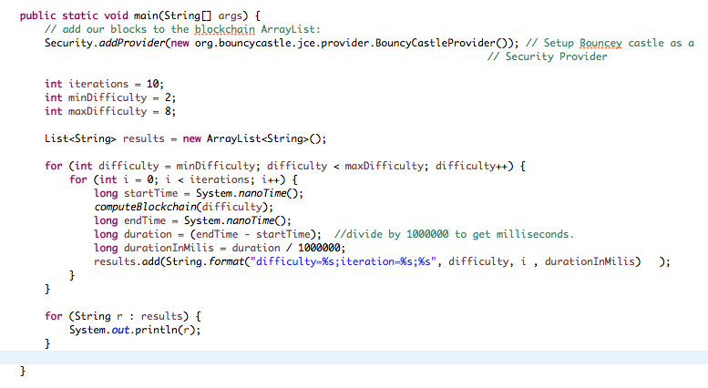

# MINE 4204 - Laboratorio – BlockChain

Departamento de Ingeniería de Sistemas y Computación 

Curso: MINE 4204 Información, Seguridad y Privacidad

Semestre 2018-2

- [MINE 4204 - Laboratorio – BlockChain](#mine-4204---laboratorio-%E2%80%93-blockchain)
    - [Autores](#autores)
    - [0](#0)
    - [1](#1)
    - [2](#2)
    - [3](#3)
    - [4](#4)
    - [5](#5)

## Autores 	 	
    
    Marly Piedrahita (mj.piedrahita)
    Juan Méndez (jc.mendez)

    

## 0

**Preparación:** 

Se creó proyecto Maven para facilitar la compilación y ejecución  del proyecto

## 1
¿Qué algoritmo usa el programa para manejo de criptografía asimétrica?

**Respuesta:**

El algoritmo utilizado es el *ECDSA* (Elliptic Curve Digital Signature Algorithm) el cual utiliza *elliptic curve cryptography*.

https://en.wikipedia.org/wiki/Elliptic_Curve_Digital_Signature_Algorithm
http://www.bouncycastle.org/wiki/display/JA1/Elliptic+Curve+Key+Pair+Generation+and+Key+Factories

## 2
¿Qué algoritmo usa el programa para firmar una transacción? ¿Cuál es la diferencia con el algoritmo mencionado en el punto anterior?

**Respuesta:**

Se utilza el algoritmo *SHA-2 (Secure Hash Algorithm 2)*. Este algoritmo a diferencia del primero es de tipo hashing.

https://www.baeldung.com/sha-256-hashing-java
https://en.wikipedia.org/wiki/SHA-2

## 3

En el tutorial se indica que verificar una transacción puede tomar mucho tiempo porque es necesario revisar las entradas. Explique más detalladamente el significado de esta afirmación.

**Respuesta:**

## 4
Adicione una transacción nueva: el usuario A envía al usuario C, 20 coins. Verifique el resultado.

**Respuesta:**

## 5
Cree una tabla que muestre el cambio en el número de intentos y tiempo necesario para minar usando las siguientes dificultades: 2, 3, 4, 5, 6, 7. Adicionalmente cree una gráfica que ilustre los incrementos.

**Respuesta:**

Se creó un programa que realiza el proceso para las dificultades 2, 3, 4, 5, 6, 7 donde en cada caso se ejecutan 10 iteraciones.

