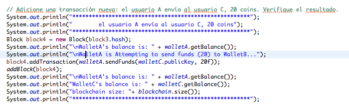
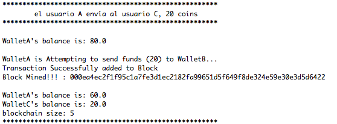

# Solución

Por:	 	
    
    Marly Piedrahita (mj.piedrahita)
    Juan Méndez (jc.mendez)

## 0

**Preparación:** 

Se creó proyecto Maven para la compilación del proyecto

## 1
¿Qué algoritmo usa el programa para manejo de criptografía asimétrica?

**Respuesta:**

## 2
¿Qué algoritmo usa el programa para firmar una transacción? ¿Cuál es la diferencia con el algoritmo mencionado en el punto anterior?

**Respuesta:**

## 3

En el tutorial se indica que verificar una transacción puede tomar mucho tiempo porque es necesario revisar las entradas. Explique más detalladamente el significado de esta afirmación.

**Respuesta:**

## 4
Adicione una transacción nueva: el usuario A envía al usuario C, 20 coins. Verifique el resultado.

**Respuesta:**

## 5
Cree una tabla que muestre el cambio en el número de intentos y tiempo necesario para minar usando las siguientes dificultades: 2, 3, 4, 5, 6, 7. Adicionalmente cree una gráfica que ilustre los incrementos.