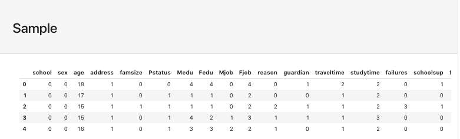
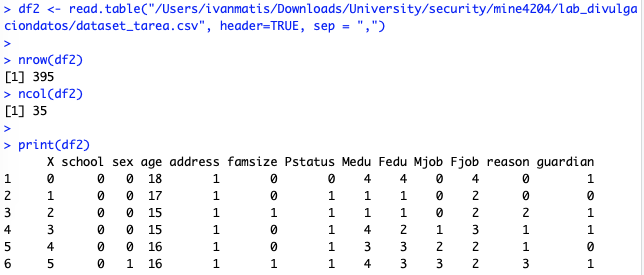

# MINE 4204 - Laboratorio - Control estadístico de divulgación de datos

Departamento de Ingeniería de Sistemas y Computación 

Curso: MINE 4204 Información, Seguridad y Privacidad

Semestre 2018-2

- [MINE 4204 - Laboratorio - Control estadístico de divulgación de datos](#mine-4204---laboratorio---control-estadi%CC%81stico-de-divulgacio%CC%81n-de-datos)
    - [Autores](#autores)
    - [Respuestas](#respuestas)
        - [Sección 1](#secci%C3%B3n-1)
            - [a. ¿Hay relaciones entre algunos de ellos?](#a-%C2%BFhay-relaciones-entre-algunos-de-ellos)
            - [b. ¿Es necesario suprimir algun atributo?](#b-%C2%BFes-necesario-suprimir-algun-atributo)
            - [c. ¿Cuáles son deducibles a partir de otros?](#c-%C2%BFcua%CC%81les-son-deducibles-a-partir-de-otros)
            - [d. ¿Cuáles son categóricos y cuáles numéricos?](#d-%C2%BFcua%CC%81les-son-catego%CC%81ricos-y-cua%CC%81les-nume%CC%81ricos)
        - [Sección 2](#secci%C3%B3n-2)
            - [a. Indique los cambios realizados.](#a-indique-los-cambios-realizados)
        - [Sección 3](#secci%C3%B3n-3)
        - [Sección 4](#secci%C3%B3n-4)
            - [a. ¿Hay observaciones únicas? ¿Cuántas?](#a-%C2%BFhay-observaciones-u%CC%81nicas-%C2%BFcua%CC%81ntas)
            - [b. ¿El riesgo de re-identificación es muy alto?](#b-%C2%BFel-riesgo-de-re-identificacio%CC%81n-es-muy-alto)
            - [c. Copie los comandos ejecutados para cumplir con este punto.](#c-copie-los-comandos-ejecutados-para-cumplir-con-este-punto)
        - [Sección 5](#secci%C3%B3n-5)
            - [a. Copie los comandos ejecutados para cumplir con este punto.](#a-copie-los-comandos-ejecutados-para-cumplir-con-este-punto)
        - [Sección 6](#secci%C3%B3n-6)
            - [a. Copie los comandos ejecutados para cumplir con este punto.](#a-copie-los-comandos-ejecutados-para-cumplir-con-este-punto-1)

## Autores 	 	
    
    Marly Piedrahita (mj.piedrahita)
    Juan Méndez (jc.mendez)

Source Code:

    https://github.com/dersteppenwolf/mine4204/tree/master/lab_divulgaciondatos


## Respuestas 

### Sección 1

####    a. ¿Hay relaciones entre algunos de ellos?

Para determinar si hay relaciones entre atributos se realizó un análisis de correlación.

Para la generación de  dicho análisis, además de la revisión descriptiva de los datos,  se utilizó la herramienta Pandas Profiling (https://github.com/pandas-profiling/pandas-profiling). 
(Nota: Puede encontrar el notebook de Jupyter en el archivo **data_quality.ipynb** que se encuentra en esta misma carpeta )

Se encontró correlación entre algunas variables tales como:
    
    Medu / Fedu
    Dalc / Walc
    G1 / G2 / G3


####    b. ¿Es necesario suprimir algun atributo?
    
No. Dado que en el dataset hay datos que sirvan como identificadores únicos de los individuos.

####    c. ¿Cuáles son deducibles a partir de otros?
    
Para los atributos que tienen una correlación alta es probable
que se puedan hacer deducciones  a través de otros.

Para el caso de este dataset tenemos que hay correlación entre los siguientes atributos:

    Medu / Fedu
    Dalc / Walc
    G1 / G2 / G3

    
####    d. ¿Cuáles son categóricos y cuáles numéricos?

La clasificación de Categóricos y Numéricos se obtuvo a partir de la operación info() del dataframe de pandas (https://pandas.pydata.org/pandas-docs/stable/generated/pandas.DataFrame.info.html ) 

Categoricas: 	17


    school        395 non-null object
    sex           395 non-null object
    address       395 non-null object
    famsize       395 non-null object
    Pstatus       395 non-null object
    Mjob          395 non-null object
    Fjob          395 non-null object
    reason        395 non-null object
    guardian      395 non-null object
    famsup        395 non-null object
    paid          395 non-null object
    activities    395 non-null object
    nursery       395 non-null object
    higher        395 non-null object
    internet      395 non-null object
    romantic      395 non-null object
    schoolsup     395 non-null object


Numericas: 	16

    age           395 non-null int64
    Medu          395 non-null int64
    Fedu          395 non-null int64
    traveltime    395 non-null int64
    studytime     395 non-null int64
    failures      395 non-null int64
    famrel        395 non-null int64
    freetime      395 non-null int64
    goout         395 non-null int64
    Dalc          395 non-null int64
    Walc          395 non-null int64
    health        395 non-null int64
    absences      395 non-null int64
    G1            395 non-null int64
    G2            395 non-null int64
    G3            395 non-null int64
    w             395 non-null int64

### Sección 2


Para los atributos binarios y nominales que así lo requieran, cambie las etiquetas de texto por
identificadores numéricos 
(e.g. en los binarios, cambie “yes” por 1 y “no” por 0).

####    a. Indique los cambios realizados.

Procedimiento Realizado:

Para la conversión de las variables categóricas en numéricas se realizó el siguiente procedimiento:

1. Convertir los atributos de tipo object en variable categórica:

```python
df['school'] = df['school'].astype('category')
df['sex'] = df['sex'].astype('category')
df['address'] = df['address'].astype('category')
df['famsize'] = df['famsize'].astype('category')
df['Pstatus'] = df['Pstatus'].astype('category')
df['Mjob'] = df['Mjob'].astype('category')
df['Fjob'] = df['Fjob'].astype('category')
df['reason'] = df['reason'].astype('category')
df['guardian'] = df['guardian'].astype('category')
df['famsup'] = df['famsup'].astype('category')
df['paid'] = df['paid'].astype('category')
df['activities'] = df['activities'].astype('category')
df['nursery'] = df['nursery'].astype('category')
df['higher'] = df['higher'].astype('category')
df['internet'] = df['internet'].astype('category')
df['romantic'] = df['romantic'].astype('category')
df['schoolsup'] = df['schoolsup'].astype('category')
```

2. Codificar las variables categóricas como numéricas

```python
cat_columns = df.select_dtypes(['category']).columns
df[cat_columns] = df[cat_columns].apply(lambda x: x.cat.codes)
```

3. Exportar los datos resultantes como csv (**dataset_tarea.csv**)
```python
df.to_csv('dataset_tarea.csv')
```


Ejemplo de la tabla recodificada:




### Sección 3

Cargue el archivo resultante a RStudio. Para ello,puede utilizar el siguiente comando:

```R
<suFrame> =read.table("C:/la_ruta_a_su_archivo.csv",sep=";",header=TRUE)
```

Comando Utilizado

```R
library(sdcMicro)

df2 <- read.table("/lab_divulgaciondatos/dataset_tarea.csv", header=TRUE, sep = ",") 

nrow(df2)
ncol(df2)

print(df2)
```

Ejemplo Salida R Studio:





### Sección 4

Puesto que ya identificó qué variables son categóricas, puede proceder con la anonimización de dichas variables. Empiece identificando las frecuencias y riesgos de divulgación. Una vez tenga conocimiento de la existencia de combinaciones únicas de variables, utilice los métodos de recodificación global y supresión local para reducir el riesgo asociado. Puede graficar este último y valerse de los métodos previamente presentados.


####    a. ¿Hay observaciones únicas? ¿Cuántas?

####    b. ¿El riesgo de re-identificación es muy alto?

####    c. Copie los comandos ejecutados para cumplir con este punto.

Nota: Puede suponer que se cumple el supuesto de distribución Poisson de fk y Fk, porque los datos fueron especialmente preparados para ello.

### Sección 5

5. Es necesario continuar el proceso con las variables numéricas. Considere las posibilidades de añadir ruido, o efectuar rank swapping sobre alguno(s) de ellos. Posteriormente, utilice el procedimiento de microagreagación para perturbar el conjunto de datos. Por último, no olvide evaluar estas transformaciones verificando la pérdida de información y el riesgo de divulgación. Note que estos dos últimos representan un trade-off a nivel del proceso de anonimización, porque el riesgo se disminuye sustancialmente a medida que aumenta el nivel de pérdida de información, pero, como es natural, no es deseable que este nivel crezca exponencialmente; razón por la cual es necesario encontrar un equilibrio entre ambos.


####    a. Copie los comandos ejecutados para cumplir con este punto.

### Sección 6

Una vez haya verificado que el riesgo ha sido efectivamente reducido en ambos casos(variables categóricas y numéricas), unifique todo en un único dataset anonimizado que usted divulgaría sin temor de re- identificación de los estudiantes portugueses del estudio.


####   a. Copie los comandos ejecutados para cumplir con este punto.


