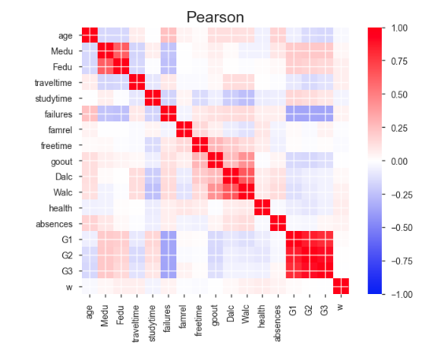
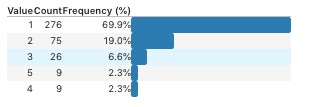
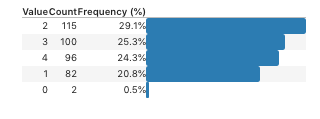

# MINE 4204 - Laboratorio - Control estadístico de divulgación de datos

Departamento de Ingeniería de Sistemas y Computación 

Curso: MINE 4204 Información, Seguridad y Privacidad

Semestre 2018-2

- [MINE 4204 - Laboratorio - Control estadístico de divulgación de datos](#mine-4204---laboratorio---control-estadi%CC%81stico-de-divulgacio%CC%81n-de-datos)
    - [Autores](#autores)
    - [Respuestas](#respuestas)
        - [Sección 1](#secci%C3%B3n-1)
            - [a. ¿Hay relaciones entre algunos de ellos?](#a-%C2%BFhay-relaciones-entre-algunos-de-ellos)
            - [b. ¿Es necesario suprimir algun atributo?](#b-%C2%BFes-necesario-suprimir-algun-atributo)
            - [c. ¿Cuáles son deducibles a partir de otros?](#c-%C2%BFcua%CC%81les-son-deducibles-a-partir-de-otros)
            - [d. ¿Cuáles son categóricos y cuáles numéricos?](#d-%C2%BFcua%CC%81les-son-catego%CC%81ricos-y-cua%CC%81les-nume%CC%81ricos)
            - [a. Indique los cambios realizados.](#a-indique-los-cambios-realizados)

## Autores 	 	
    
    Marly Piedrahita (mj.piedrahita)
    Juan Méndez (jc.mendez)

Source Code:

    https://github.com/dersteppenwolf/mine4204/tree/master/lab_divulgaciondatos

## Respuestas 

### Sección 1

####    a. ¿Hay relaciones entre algunos de ellos?

Se encontró correlación entre algunas variables tales como:
    
    Medu / Fedu
    Dalc / Walc
    G1 / G2 / G3

####    b. ¿Es necesario suprimir algun atributo?
    
No. Dado que no hay datos que permitan  la identificación de una persona de forma única.   

####    c. ¿Cuáles son deducibles a partir de otros?
    
Los atributos que tienen una correlación alta es probable
que sean deducidos a través de otros.
Para el caso de este dataset:

    Medu / Fedu
    Dalc / Walc
    G1 / G2 / G3

    
####    d. ¿Cuáles son categóricos y cuáles numéricos?

Categoricas: 	17

    school        395 non-null object
    sex           395 non-null object
    age           395 non-null int64
    address       395 non-null object
    famsize       395 non-null object
    Pstatus       395 non-null object
    Mjob          395 non-null object
    Fjob          395 non-null object
    reason        395 non-null object
    guardian      395 non-null object
    famsup        395 non-null object
    paid          395 non-null object
    activities    395 non-null object
    nursery       395 non-null object
    higher        395 non-null object
    internet      395 non-null object
    romantic      395 non-null object
    schoolsup     395 non-null object

Numericas: 	16

    Medu          395 non-null int64
    Fedu          395 non-null int64
    traveltime    395 non-null int64
    studytime     395 non-null int64
    failures      395 non-null int64
    famrel        395 non-null int64
    freetime      395 non-null int64
    goout         395 non-null int64
    Dalc          395 non-null int64
    Walc          395 non-null int64
    health        395 non-null int64
    absences      395 non-null int64
    G1            395 non-null int64
    G2            395 non-null int64
    G3            395 non-null int64
    w             395 non-null int64

### Sección 2

Para los atributos binarios y nominales que así lo requieran, cambie las etiquetas de texto por
identificadores numéricos 
(e.g. en los binarios, cambie “yes” por 1 y “no” por 0).

####    a. Indique los cambios realizados.

Procedimiento Realizado:
Se realizó una revisión a las frecuencias de los diferentes atributos a través de un reporte generado con Pandas Profiling encontrando que algunos atributos valores de baja frecuencia que potencialmente podrían llegar a identificar a individuos particulares.

En ese orden de ideas se decidió recodificar los siguientes atributos: 

    age

    dalc

    fedu
 
